<div align="center">



<br /><br />

**Build, share, and analyse data in real time with your team.**

<br />

   

<br /><br />

**Part of the [InfoDot Ecosystem](https://github.com/sakhileb/InfoDot)** &nbsp;·&nbsp; `sheet.infodot.app`

</div>

---

## What is Dot.Sheet?

Dot.Sheet is the collaborative data platform in the InfoDot ecosystem. Spreadsheet-style grids, pivot views, and AI-generated formulas give teams the power of a spreadsheet with the collaboration of a shared workspace — no desktop app required.

## Core Features

- Grid editor with formulas, conditional formatting, and data validation
- AI formula assistant — describe what you want, get the formula
- Real-time collaborative editing via Laravel Reverb
- Pivot tables and chart generation from grid data
- Import CSV / XLSX and export back to either format
- Named ranges, cell comments, and version history
- Row-level access control per sheet
- Ecosystem SSO from InfoDot hub

## Domain Models

- **Sheet** — named spreadsheet with metadata
- **SheetTab** — individual tab within a sheet
- **SheetCell** — cell value and formula
- **SheetChart** — chart config linked to a cell range

## Tech Stack

| Layer | Technology |
|---|---|
| Framework | Laravel 12 |
| Language | PHP 8.4 |
| Frontend | Livewire 3 · Alpine.js 3 · Tailwind CSS |
| Database | PostgreSQL 16 (shared across ecosystem) |
| Realtime | Laravel Reverb |
| Auth | Laravel Sanctum (InfoDot SSO) |
| AI | Anthropic Claude (`claude-sonnet-4-6`) |
| Storage | AWS S3 / Local (Flysystem) |
| Search | Laravel Scout · Meilisearch |
| Queue | Redis · Laravel Horizon |

## Quick Start

```bash
git clone https://github.com/sakhileb/Dot.Sheet.git
cd Dot.Sheet
cp .env.example .env
composer install
npm install && npm run build
php artisan key:generate
php artisan migrate
php artisan serve
```

> **Ecosystem SSO:** Set `DB_*` env vars to the shared InfoDot PostgreSQL instance and `APP_URL=https://sheet.infodot.app`. Users authenticated through InfoDot gain access automatically via Sanctum handoff tokens.

## Ecosystem

**Dot.Sheet** is one of **21 platforms** in the InfoDot ecosystem, connected via shared PostgreSQL and Sanctum SSO. Visit [InfoDot](https://github.com/sakhileb/InfoDot) to explore the full platform map.

## License

MIT © [SK Digital / BluPin Incorporated](https://github.com/sakhileb)
